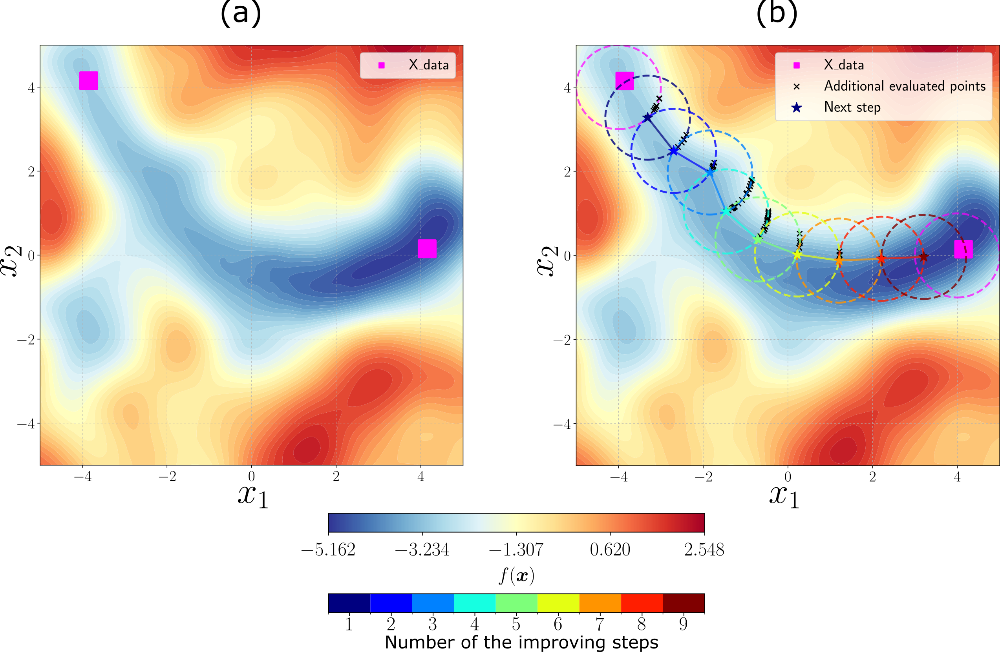

<div align="center">

# Attraction Basin Analysis
</div>

<div align="center">

  <a href="https://mit-license.org/"></a>
  <a href="https://www.python.org/downloads/"></a>
  <a href="https://github.com/psf/black"></a>
  <a href="https://git.liacs.nl/antonovk/basinsattribution"></a>
</div>

## Overview
This repository contains the implementation of the attraction basin analysis methods used in the research paper *"New Solutions to Cooke Triplet Problem via Analysis of Attraction Basins"* by Kirill Antonov, Tiago Botari, Teuss Tukker, Thomas Bäck, Niki van Stein, and Anna V Kononova. The code is designed to analyze optimization landscapes and classify solutions into attraction basins.

The methodology enables efficient partitioning of high-quality solutions in complex search spaces, such as optical system design, by analyzing the structure of attraction basins. This approach is independent of problem dimensionality and can be applied to various optimization problems.

<div align="center">



</div>
Figure: Example of an optimization landscape and two points in panel (a). The results of the processing by the proposed algorithm are depicted in panel (b). The improving path between magenta points has been identified; therefore, they are located in the same attraction basin.


## Features
- **Attraction Basin Analysis**: Identifies and partitions solutions based on attraction basins.
- **Evolutionary Search Heuristics**: Uses pathfinding techniques to approximate attraction basin structures.
- **Applications in Optical System Design**: Can be used for problems like Cooke Triplet optimization.

## Requirements
To run the code, install the following dependencies:

- Python 3.x
- NumPy
- Matplotlib

## Installation
Clone this repository and install the necessary dependencies:
```bash
git clone --recursive https://github.com/BasinAttribution.git
cd BasinAttribution
pip install -r requirements.txt
```

## Usage
We provide an example of application in the Jupyter notebook `examples.ipynb`, which demonstrates how to analyze attraction basins step by step.
The code is structured into several main components:

### Analyzing Attraction Basins
To analyze an optimization landscape and classify solutions into attraction basins, run:
```bash
python analyze_basins.py --input solutions.csv --function rastrigin
```
This will partition the solutions and identify attractors.


## Data Format
- `solutions.csv`: Stores solutions used for attraction basin analysis.

## Results and Interpretation
- Attraction basin analysis reveals the structure of optimization landscapes.
- The methodology is useful for optical system design and other applications.

## Citation
If you use this code for research, please cite:
```
@inproceedings{10.1117/12.2675836,
  author = {Kirill Antonov and Tiago Botari and Teuss Tukker and Thomas B{\"a}ck and Niki van Stein and Anna V. Kononova},
  title = {{New solutions to Cooke triplet problem via analysis of attraction basins}},
  volume = {12624},
  booktitle = {Digital Optical Technologies 2023},
  organization = {International Society for Optics and Photonics},
  publisher = {SPIE},
  pages = {126240T},
  year = {2023},
  doi = {10.1117/12.2675836},
  URL = {https://doi.org/10.1117/12.2675836}
}
```

## License
This project is licensed under the MIT License - see the LICENSE file for details.

## Contact
For questions and collaborations, please contact Kirill Antonov at [k.antonov@liacs.leidenuniv.nl](mailto:k.antonov@liacs.leidenuniv.nl).

